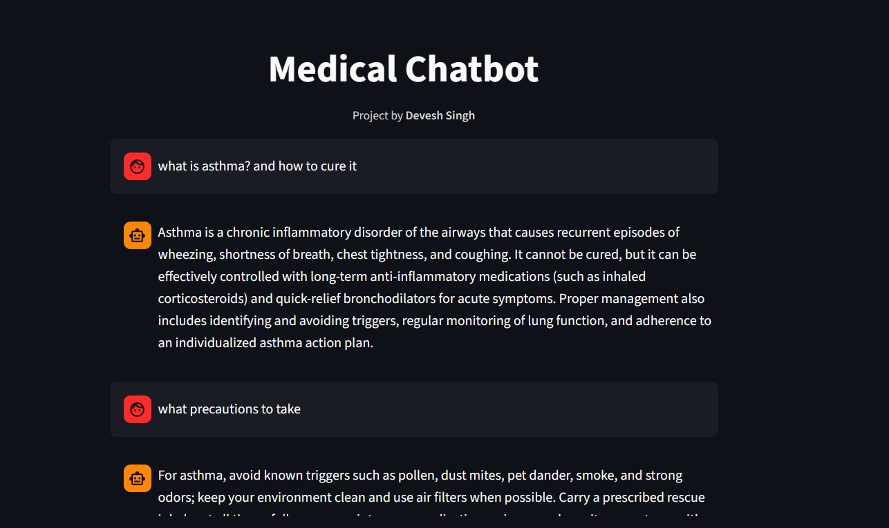

# Medical Chatbot

**Check out the live app here:  [Live Demo](https://demonforms-car-damage.streamlit.app/)**

A conversational AI chatbot designed to assist users with medical queries, provide health information, and guide users to appropriate resources. Built with Large Language Model with Retrieval Augmented Generation (RAG) concept for reliability and ease of use with LangChain, Pinecone, HuggingFace and Groq.

## Features

- Natural language understanding for medical questions
- Provides general health information and guidance
- User-friendly chat interface

## Technologies Used

- Python
- Generative AI Concepts - Langchain, RAG, LLM
- Vector Database - Pinecone
- Web framework - Streamlit

## Usage

- Enter your medical questions in the chat interface.
- The chatbot will respond with relevant information or guidance.

## License

This project is licensed under the MIT License.

## Author

Developed by Devesh Singh

## Disclaimer

This chatbot does **not** provide medical diagnoses or treatment. Always consult a healthcare professional for medical advice.